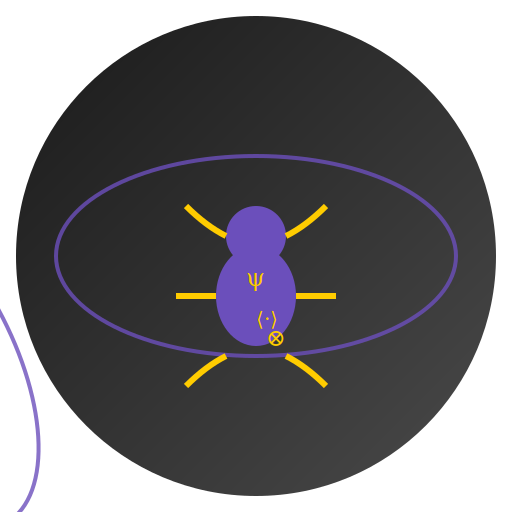

#  QUMO - Quantum Unicode Machine Optimizer

[](https://badge.fury.io/py/qumo)
[](https://pypi.org/project/qumo/)
[](https://opensource.org/licenses/MIT)
[](https://github.com/astral-sh/ruff)

A next-generation code optimization framework that combines quantum-inspired patterns with Unicode optimization to create highly efficient, machine-first Python code. QUMO leverages quantum computing principles, advanced AST/CST transformations, and Unicode patterns to optimize Python code for both machine processing and human readability.

<div align="center">
  
</div>

## 🌟 Features

- 🔄 Quantum-inspired code transformations
- 🔤 Unicode pattern optimization
- 📊 Graph-based flow analysis
- 🔍 AST and CST transformations
- 🎯 Machine-first optimization principles
- 🛠️ Command-line interface with rich output

## Installation

```bash
# From GitHub
git clone https://github.com/abcdqfr/qumo.git
cd qumo
pip install -e .

# Or via pip
pip install git+https://github.com/abcdqfr/qumo.git
```

## Usage

### Command Line

Optimize a Python file:
```bash
qumo optimize input.py -o output.py
```

Show diff between original and optimized code:
```bash
qumo optimize input.py --diff
```

Show version:
```bash
qumo version
```

### Python API

```python
from qumo import optimize_code

# Optimize code
source = '''
def calculate(x, y):
    return x + y
'''

optimized = optimize_code(source)
print(optimized)
```

## Optimization Patterns

### Unicode Patterns
- Self reference: `ꜱ`
- Path handling: `ᴘ`
- Window/UI: `ᴡ`
- List operations: `ʟ`
- Quantum state: `ψ`

### Quantum Operations
- Bra-Ket notation: `⟨ψ|H|ψ⟩`
- Tensor product: `⊗`
- Direct sum: `⊕`
- Conjugate: `†`

### Flow Control
- Implies: `⇒`
- Maps to: `↦`
- Composition: `∘`
- Universal quantifier: `∀`
- Existential quantifier: `∃`

## Development

### Setup

```bash
# Clone repository
git clone https://github.com/brandon/qumo.git
cd qumo

# Install dependencies
pip install -e ".[dev]"
```

### Testing

```bash
pytest
```

### Contributing

1. Fork the repository
2. Create your feature branch (`git checkout -b feature/amazing-feature`)
3. Commit your changes (`git commit -m 'Add amazing feature'`)
4. Push to the branch (`git push origin feature/amazing-feature`)
5. Open a Pull Request

## License

MIT License - see [LICENSE](LICENSE) for details

## Acknowledgments

- Inspired by quantum computing principles
- Built with modern Python tooling
- Powered by libcst, ast, sympy, and networkx 
